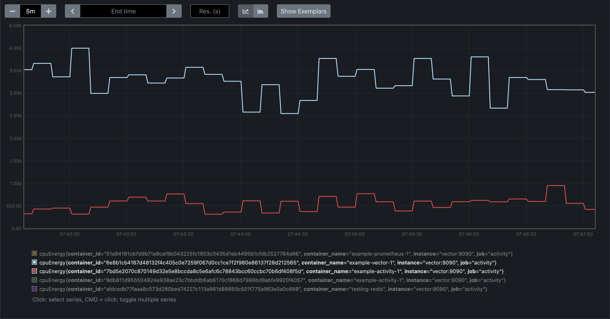

# Docker Activity

Docker activity is a tool to monitor the statistics of your containers and output their energy consumption.

**Warning** It's still in early stage, for demoing, it's going to be nicer soon...

To be able to use docker-activity, you need access to the docker engine socket and, if you want some power
consumption information, you need to have access to `/sys/class/powercap`.

**The power consumption module only works on software compatible with Intel RAPL (Intel and AMD).**

## Build and use

```bash
# Build the project in release mode
cargo build --release
# Start as root
sudo ./target/release/docker-activity tcp-socket 1.2.3.4:56
# Get some help
./target/release/docker-activity --help
```

## Build and use with docker

```bash
# Build docker image (optional)
docker build -t jdrouet/docker-activity .
# Run it
docker run \
	-v /sys/class/powercap:/sys/class/powercap:ro \
	-v /var/run/docker.sock:/var/run/docker.sock \
	-v ./output:/output \
	jdrouet/docker-activity tcp-socket 1.2.3.4:56
```

## Interfacing with Prometheus

`docker-activity` doesn't have any complex output system. You should rely on other tools to export the data somewhere.

In [the example](./example/docker-compose.yml), you can see how to interface `docker-activity` with [Vector](https://vector.dev)
in order to export that data to [Prometheus](https://prometheus.io) or any other tool.



